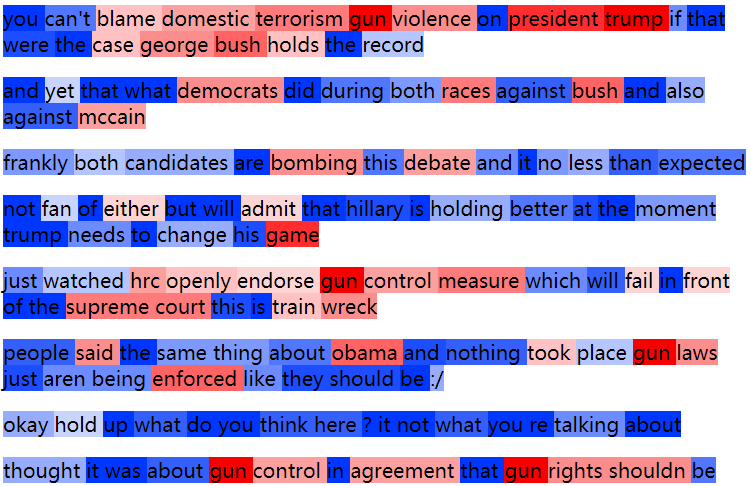

# TopicDics

TopicDisc is an unsupervised framework for jointly modeling topic content and discourse behavior in microblog conversations.

More details can be referred to:
> Jichuan Zeng, Jing Li, Yulan He, Cuiyun Gao, Michael Lyu, Irwin King. What You Say and How You Say it: Joint Modeling of Topics andDiscourse in Microblog Conversations. TACL 2019.

# Input Data
TREC-11 and TWT-16 Dataset are in `data/twitter-conv/`. 
We remove the text of each tweet according to Twitter's policy. One needs to download the tweets with the given tweet ID by [Twitter API](https://developer.twitter.com/en/docs.html). All the Tweets text should be put in `text_lst` field of `twitter_m.json` accordingly.

For example:

```angular2html
"meta_lst": [
        {
            "id": "816147858076241920"
        },
        {
            "id": "816175837737123841"
        },
        {
            "id": "816190727323459584"
        },
        {
            "id": "816192396945924096"
        }
            ],
"text_lst": [
        "<hash> When you realize TransCult thinks Radical Feminism is more \"degenerate\" than the KKK &amp; NeoNazis.\u2026 <url>", 
        "<men> Kind of interesting trans cult is using KKK/Nazi rhetoric now -- worried that their bullying is only getting them so far? \ud83d\ude02", 
        "<men> <men> LOL. That's so funny.  This must really tap into some primitive fear. Witches zooming off to cavort with satan\ud83d\ude02", 
        "<men> <men> &lt;cackles&gt; \ud83d\ude02"
]
```

# Usage
After download all the tweets, save the data file as 'twitter.json'.

You can run the main code as:
```angular2html
$ python topic_disc.py
```

You can visualize the topic and discourse distribution among words by enabling `--output_vis True`.
```angular2html
$ python topic_disc.py --output_vis True
$ cd vis/
$ python vis_atten.py   # you should put the gen_sample.txt to this folder.
```
The visualization looks like this:

<p align="center"></p>
